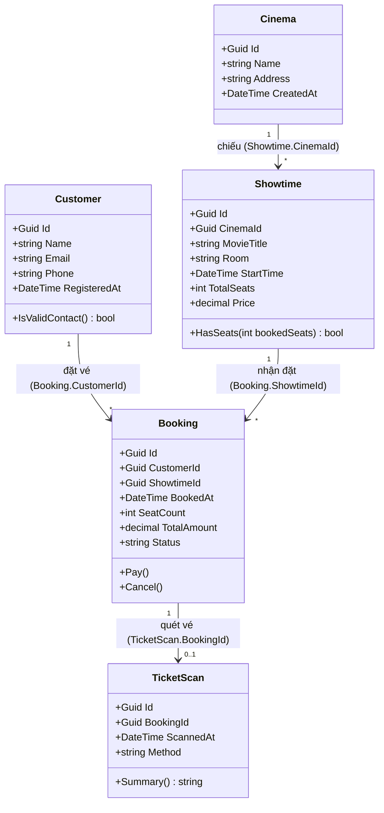

# Sơ đồ lớp sơ bộ — Web bán vé xem phim

```mermaid
classDiagram
    class Cinema {
        +Guid Id
        +string Name
        +string Address
        +DateTime CreatedAt
    }
    class Customer {
        +Guid Id
        +string Name
        +string Email
        +string Phone
        +DateTime RegisteredAt
        +IsValidContact() bool
    }
    class Showtime {
        +Guid Id
        +Guid CinemaId
        +string MovieTitle
        +string Room
        +DateTime StartTime
        +int TotalSeats
        +decimal Price
        +HasSeats(int bookedSeats) bool
    }
    class Booking {
        +Guid Id
        +Guid CustomerId
        +Guid ShowtimeId
        +DateTime BookedAt
        +int SeatCount
        +decimal TotalAmount
        +string Status
        +Pay()
        +Cancel()
    }
    class TicketScan {
        +Guid Id
        +Guid BookingId
        +DateTime ScannedAt
        +string Method
        +Summary() string
    }
    Cinema "1" --> "*" Showtime : chiếu (Showtime.CinemaId)
    Customer "1" --> "*" Booking : đặt vé (Booking.CustomerId)
    Showtime "1" --> "*" Booking : nhận đặt (Booking.ShowtimeId)
    Booking "1" --> "0..1" TicketScan : quét vé (TicketScan.BookingId)
```